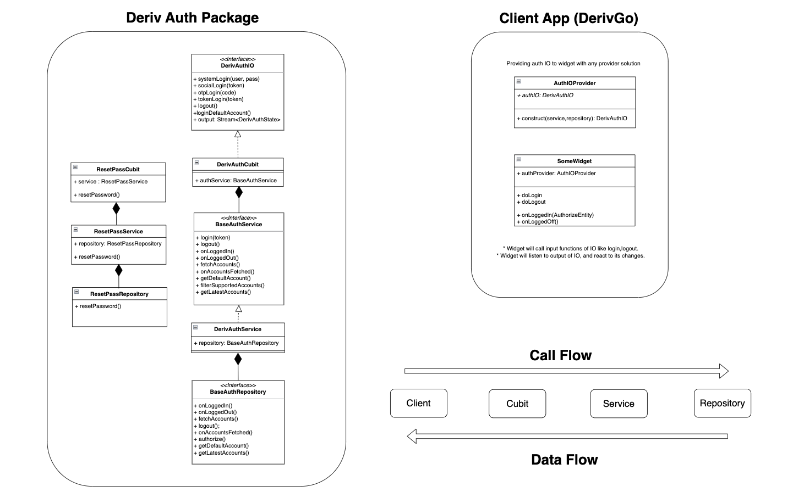

# Deriv Auth

A Dart package that provides Authentication logic for Deriv applications.

</br>

## Overview

</br>

This Dart package contains a set of cubits that handle various authentication and registration related tasks such as login, logout, and resetting password.

</br>

## Architecture

</br>



</br>

## Usage

</br>

### **_DerivAuthCubit:_**

</br>

This cubit is responsible for handling the logic related to login, logout, and authentication of a user. It overrides the various methods for handling different types of login requests such as `systemLogin`, `otpLogin`, `socialLogin`, `tokenLogin` and `authorizeDefaultAccount`.

To create an instance of `DerivAuthCubit` we will need a `DerivAuthService` which implements `BaseAuthService` that will hold the logic for the cubit. To create a `DerivAuthService` you need:

- The `DerivJwtService` which wraps a `DerivJwtRepository` that will contain all logic related to JWT token. It will require:

  - The `appToken` which is the client's unique app token.
  - `HttpClient` for Http requests.
  - The `AuthConnectionInfo` which holds the `appId` and `endpoint` of that client.

    ```dart
    /// Abstract Client connection info.
    abstract class AuthConnectionInfo {
        /// Connection endpoint.
        String get endpoint;

        /// Deriv client app ID.
        String get appId;
    }
    ```

- `DerivTokenService`: this will perform the REST request `getUserTokens`to get the tokens (accounts) related to a particular user.

- `AuthConnectionInfo`: basically, the same as the connection information passed to the `DerivJwtRepository`.

- `DerivAuthRepository` which is an instance of `BaseAuthRepository`. It requires the client to implement the following methods:

  ```dart
  /// Interface of all authentication functions required from client.
  abstract class BaseAuthRepository {
    /// Authorize user with [token].
    Future<AuthorizeResponseEntity> authorize(String? token);

    /// Client functionality after user logs in.
    Future<void> onLogin(AuthorizeEntity authorizeEntity);

    /// Log user out.
    Future<void> logout();

    /// Functionality after user logs out.
    Future<void> onLoggedOut();

    /// Get default user account from Persistance.
    Future<AccountModel?> getDefaultAccount();

    /// Get latest saved user accounts.
    Future<List<AccountModel>> getLatestAccounts();
  }
  ```

And then we can create an instance of `DerivAuthCubit` as follows:

```dart
DerivAuthCubit(
      authService: DerivAuthService(
        jwtService: DerivJwtService(
          repository: DerivJwtRepository(
            client: HttpClient(),
            appToken: loadedAppToken,
            connectionInfo: DerivAuthConnectionInfo(),
          ),
        ),
        tokenService: DerivTokenService(),
        authRepository: DerivAuthRepository(),
        connectionInfo: DerivAuthConnectionInfo(),
      ),
   ));
```

</br>

### **_DerivSignupCubit:_**

</br>

This cubit is responsible for handling the logic related to registration and opening a new virtual account. It has two main methods, `sendVerificationEmail` and `openNewVirtualAccount`.

To create an instance of `DerivSignupCubit` we need a `DerivSignupService` which implements `BaseSignupService` that holds all the logic of the cubit. A `DerivSignupService` requires:

- A `DerivSignupRepository` which is an instance of `BaseSignupRepository`. It requires the client to implement the following methods:

  ```dart
  /// Client Interface to implement [Signup] functions.
  abstract class BaseSignupRepository {
    /// Gets current server time from client.
    Future<DateTime> getClientServerTime();

    /// Send Verification email when signing up and resetting password.
    Future<VerifyEmailResponseEntity> sendVerificationEmail(
        VerifyEmailRequestEntity request);

    /// Creating new virtual account.
    Future<AccountModel> openNewVirtualAccount({
        required NewVirtualAccountRequestModel newVirtualAccountModel,
    });
  }
  ```

Then we can proceed to create a `DerivSignupCubit` as follows
:

```dart
DerivSignupCubit(
      service: DerivSignupService(
        repository: DerivSignupRepository(),
      ),
    ));
```

</br>

### **_DerivResetPasswordCubit:_**

</br>

This cubit is responsible for handling the logic related to resetting a user's password. It has two main methods, `sendVerificationEmail` and `changePassword`, that are used to handle different stages of resetting a user's password.

To create an instance of `DerivResetPasswordCubit` we need a `DerivResetPasswordService` which implements `BaseResetPasswordService` that holds all the logic of the cubit. A `DerivResetPasswordService` requires:

- A `DerivResetPasswordRepository` which is an instance of `BaseSignupRepository`. It requires the client to implement the following methods:

  ```dart
  /// Client Interface to implement [ResetPassword] functions.
  abstract class BaseResetPasswordRepository {
      /// Change user password using provided token.
      Future<bool> resetPassword({
          required String verificationCode,
          required String newPassword,
      });
      /// Send Verification email when signing up and resetting password.
      Future<VerifyEmailResponseEntity> sendVerificationEmail(
          VerifyEmailRequestEntity request);
  }
  ```

Then we can proceed to create a `DerivResetPassCubit` as follows:

```dart
DerivResetPassCubit(
      service: DerivResetPasswordService(
        repository: DerivResetPasswordRepository(),
      ),
    );
```
