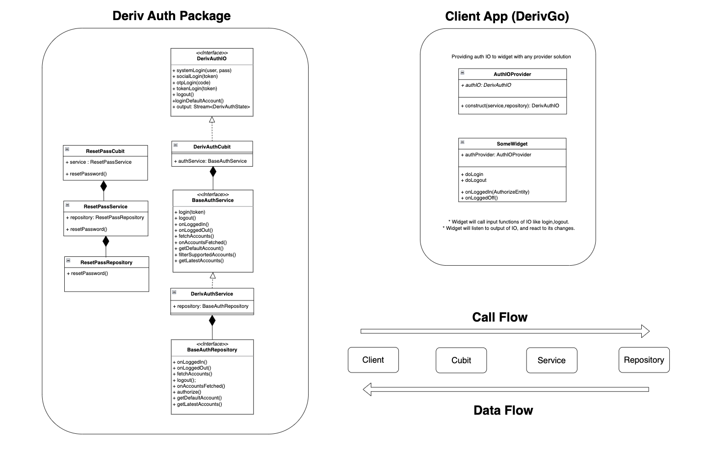

# deriv_auth

A Dart package that provides Authentication logic for Deriv applications.

 

## Getting started:

#

This Dart package contains a set of cubits that handle various authentication and registration related tasks such as login, logout, and resetting password.

 

## Oerview:

#

 

## Usage:

#

### **_DerivAuthCubit:_**

This cubit is responsible for handling the logic related to login, logout, and authentication of a user. It overrides the various methods for handling different types of login requests such as `systemLogin`, `otpLogin`, `socialLogin`, `tokenLogin` and `authorizeDefaultAccount`.

It requires the client to implement the following functions:

- `authorize`: Perform the API request to authorize a user with token.

- `onLogin`: Executed after the user is logged in.

- `logout`: API request to log user out.

- `onLoggedOut`: Executed after the user is logged out.

- `getDefaultAccount`: Return the default account from Secure Storage.

- `getLatestAccounts`: Return the list of saved accounts from Secure Storage.

 

### **_DerivSignupCubit:_**

This cubit is responsible for handling the logic related to registration and opening a new virtual account. It has two main methods, `sendVerificationEmail` and `openNewVirtualAccount`.

It requires the client to implement the following functions:

- `getClientServerTime`: Return current server time.

- `sendVerificationEmail`: API call to send the verification email.

- `openNewVirtualAccount`: API call to create a new virtual account.

 

### **_DerivResetPasswordCubit:_**

This cubit is responsible for handling the logic related to resetting a user's password. It has two main methods, `sendVerificationEmail` and `changePassword`, that are used to handle different stages of resetting a user's password.

It requires the client to implement the following functions:

- `sendVerificationEmail`: API call to send the verification email.
- `changePassword`: API call to reset a user's password.
