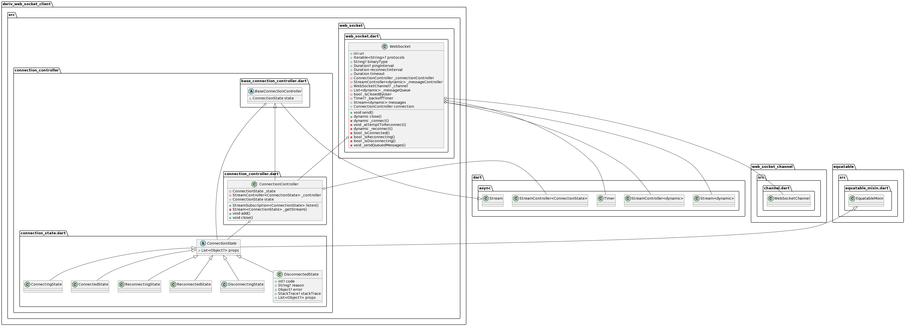

# Deriv WebSocket Client

This is a WebSocket connection handler package that simplifies the management of WebSocket connections and provides a high-level API for handling WebSocket communication in Dart applications. The package is built on top of the `web_socket_channel` library but abstracts away some of the complexities of directly using `web_socket_channel`.



### Example

Here's a simple example of how to use the WebSocket connection handler:

```dart
import 'dart:async';
import 'dart:convert';
import 'dart:io';

import 'package:deriv_web_socket_client/deriv_web_socket_client.dart';

void main() async {
  // Define the [uri] to which to connect.
  final Uri uri = Uri.parse('wss://ws.binaryws.com/websockets/v3?app_id=1089');
  // Create a [WebSocket] instance from [uri] and connect to it.
  final WebSocket socket = WebSocket(uri);

  // Listen to the [connection] state changes.
  socket.connection.listen(stdout.writeln);
  // Listen to the [messages] received from the server.
  socket.messages.listen(stdout.writeln);

  // Send a message to the server.
  socket.send(jsonEncode(<String, dynamic>{'ticks': 'R_50', 'subscribe': 1}));

  // Wait for 60 seconds to receive messages from the server.
  // This is just for preventing the program from exiting.
  await Future<void>.delayed(const Duration(seconds: 60));

  // Close the connection.
  await socket.close();
}
```

### Benefits

- `Simplified API`: This package abstracts away the low-level details of WebSocket management and provides a higher-level API for ease of use.
- `Connection State Tracking`: The ConnectionController allows you to easily track the state of the WebSocket connection and handle state changes accordingly.
- `Automatic Reconnections`: The WebSocket class handles automatic reconnections in case of disconnection, ensuring a more robust WebSocket experience.
- `Multi Platform Support`: The package provides implementations for multiple platforms including Mobile and Web.
- `Queue Requests`: The WebSocket class queues requests while the WebSocket connection is not open and sends them once the connection is open.

### Issue Solved

The main issue this package solves is the complexity of directly using `web_socket_channel` and handling WebSocket connections manually. By providing a higher-level abstraction and state management, this package makes it easier to work with WebSockets, simplifies error handling and reconnects, and improves overall code organization.

### Credits

This package is based on web_socket_client package by [Felix Angelov's web_socket_client package](https://github.com/felangel/web_socket_client) and customized to fit project requirements.
